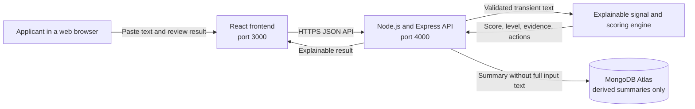
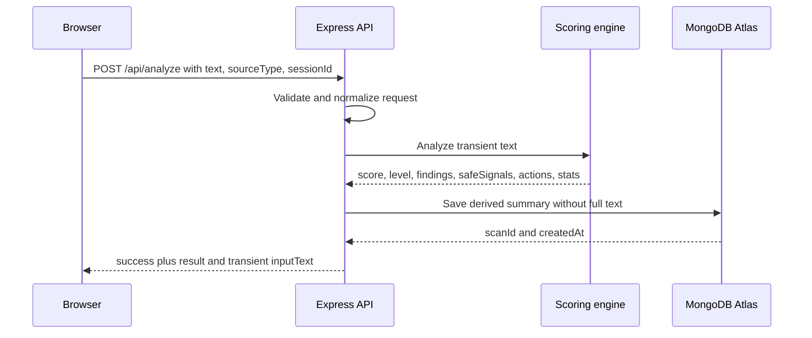

# OfferGuard architecture

## Scope

OfferGuard is an explainable job and internship offer risk screener in the Web
Apps category. Its architecture is deliberately small enough for a reliable
MVP while retaining a real frontend, API, database, privacy boundary, and
testable scoring engine.

The system does not claim to identify fraud conclusively. It analyzes only the
submitted text and returns educational risk signals and verification actions.

## System context



## Components

### React frontend

- Runs locally at `http://localhost:3000`.
- Collects `text` and a `sourceType` of `whatsapp`, `email`, `sms`, or
  `job_portal`.
- Creates and reuses a pseudonymous browser `sessionId` for recent history.
- Calls the API configured by `NEXT_PUBLIC_API_URL`.
- Renders the score, `level`, findings, safe signals, actions, and statistics.
- Does not calculate or reinterpret the score independently.

### Express API

- Runs locally at `http://localhost:4000`.
- Validates request shape and source type.
- Applies CORS using `CORS_ORIGIN`.
- Coordinates scoring, privacy-safe persistence, history retrieval, and
  deletion.
- Must not log request bodies or full submitted text.

### Explainable scoring engine

- Uses deterministic, reviewable indicators rather than a runtime AI service.
- Associates each finding with an observable textual signal and explanation.
- Produces a bounded score and a human-readable `level`.
- Returns both warning findings and safe signals so the output is not based only
  on negative keywords.
- Keeps thresholds and weights server-side as the single scoring source of
  truth.

### MongoDB Atlas

- Stores only the derived data required for recent scan history.
- Never stores the complete submitted message or the transient `inputText`
  returned by `POST /api/analyze`.
- Associates summaries with a pseudonymous `sessionId`.
- Supports removal of an individual summary through the delete endpoint.

## API surface

| Method | Route | Responsibility |
| --- | --- | --- |
| `GET` | `/api/health` | Report API status and active storage type. |
| `POST` | `/api/analyze` | Validate and analyze text, return the full transient result, and store only its privacy-safe summary. |
| `GET` | `/api/scans?sessionId=<id>&limit=6` | Return recent summaries for a browser session. |
| `DELETE` | `/api/scans/:id?sessionId=<id>` | Remove a summary when its scan and session identifiers match. |

The analyze request is:

```json
{
  "text": "Submitted offer text",
  "sourceType": "job_portal",
  "sessionId": "browser-generated-session-id"
}
```

A successful response has the top-level shape:

```json
{
  "success": true,
  "data": {
    "scanId": "...",
    "createdAt": "...",
    "sourceType": "job_portal",
    "inputText": "Submitted offer text",
    "score": 0,
    "level": "...",
    "headline": "...",
    "summary": "...",
    "findings": [],
    "safeSignals": [],
    "actions": [],
    "stats": {}
  }
}
```

`inputText` exists only in the immediate response. History is built from the
privacy-safe stored summary and cannot reconstruct the full source text.

## Analyze sequence



## Privacy and security boundaries

### Data that may be persisted

- Scan identifier and creation time
- Pseudonymous session identifier
- Source type
- Score and level
- Derived findings, safe signals, actions, and statistics that do not recreate
  the full submitted message

### Data that must not be persisted

- The complete submitted `text`
- The transient response field `inputText`
- Request bodies in application or hosting logs
- Credentials, passwords, identity numbers, or banking details

The browser session identifier is a convenience for history, not authentication.
Anyone who obtains it may be able to access its summaries, so history must remain
minimal and non-sensitive. Production uses HTTPS, server-only database
credentials, least-privilege Atlas access, input size limits, and restrictive
CORS.

## Scoring model and limitations

The engine evaluates risk indicators such as advance-payment requests,
high-pressure wording, sensitive-data requests, unverifiable contact methods,
and unrealistic claims. It also records reassuring signals. Each activated rule
contributes a documented weight; the aggregate is bounded before the API maps it
to a `level`.

This is explainable classification, not identity or company verification.
Wording alone cannot prove legitimacy or fraud. The model may miss novel scams
and may flag legitimate but informal recruitment. Consequently:

- Every result includes evidence and suggested verification steps.
- No individual rule should be presented as conclusive.
- A low score is not a safety guarantee.
- A high score is not an accusation of fraud.
- Weight and threshold changes require regression fixtures to prevent accidental
  score drift.

## Test strategy

### Unit tests

- Individual risk and safe-signal rules
- Weight aggregation, score bounds, and level thresholds
- Duplicate or overlapping signal behavior
- Stable output for representative fixtures

### API tests

- Request validation for missing or invalid `text`, `sourceType`, and
  `sessionId`
- Success and error contracts for all four routes
- CORS behavior
- History ownership filtering by session ID
- Delete behavior for matching and non-matching sessions
- Database failure and health-check behavior

### Privacy regression test

Submit a unique sentinel sentence, complete an analysis, then inspect the stored
MongoDB document and serialized history response. The sentinel must not appear
in either location. This test is a release gate.

### Frontend and end-to-end checks

- Analyze safe, suspicious, mixed, empty, and long samples
- Render the returned evidence without recomputing the result
- Refresh and retrieve recent summaries
- Delete one summary and confirm it remains absent after refresh
- Test keyboard navigation, narrow screens, loading, error, and empty states

## Deployment plan

### Frontend

- Deploy to a public HTTPS host.
- Set `NEXT_PUBLIC_API_URL` to the public backend origin before building.
- Confirm no localhost URL remains in the production bundle.

### Backend

- Deploy to a Node.js host.
- Set `MONGODB_URI`, `PORT`, and `CORS_ORIGIN` as protected platform
  configuration.
- Use `GET /api/health` for readiness checks and require `storage: "mongodb"`
  in production.
- Disable request-body logging and restrict CORS to the deployed frontend.

### Database

- Use a dedicated Atlas database and least-privilege application user.
- Require TLS and restrict network access to the backend host where possible.
- Confirm stored records omit full source text before launch.

### Release verification

Open the deployed frontend, repository, and demo video in a clean incognito
window. Complete analysis, history, refresh, and delete flows. Treat a private
repository, inaccessible video, broken live link, CORS failure, exposed secret,
or persisted full message as a submission blocker.
